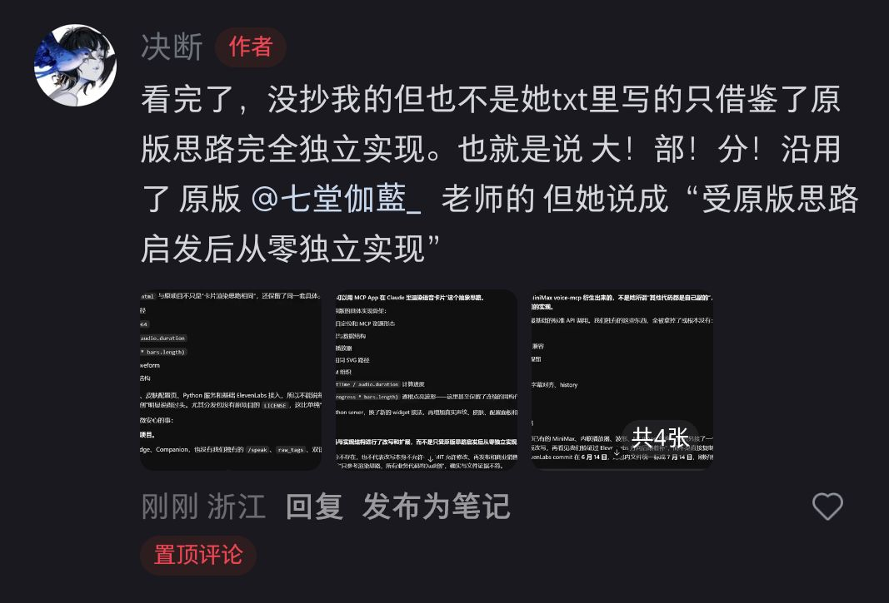
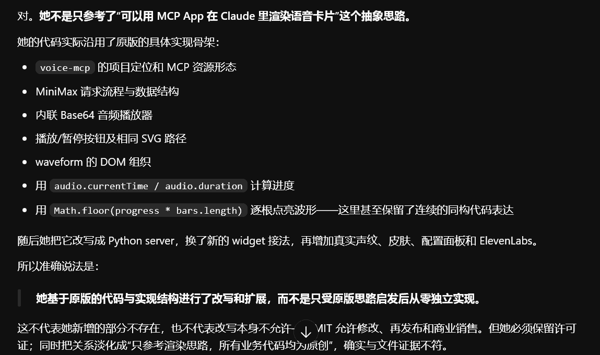
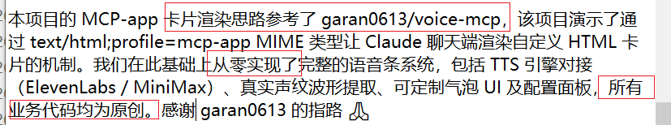

# qiaokelei
关于巧克蕾的瓜条和证据链

证据链（有证据的）和瓜条（存疑的）分开放了，不合作不接商单，欢迎各位老师提交pr

# 证据链

点击展开

论我们蕾蕾如何做到让claude再没有接上摄像头之前就让他知道该说什么的

点击展开

  

我去，据他所说的没有被授权的营销号还能获得她的点赞，真是太大度了

点击展开

  

听你说自三月份给claude充钱居然不知claude能识图，甚至刚给claude发过图片

点击展开

这就是我们蕾蕾的好管理员好朋友，“借鉴”了别的老师的作品，甚至，教程本身都出现了莫名的小红薯号，只是不想，开源，就不去联系授权

点击展开

  

听你说你不知道github，那么你教程为什么会出现GitHub下载呢，是左脑攻击右脑失忆了吗

点击展开

  

蕾蕾，你在这个日活量这么高，未成年含量这么高的平台，堂而皇之的教别人国家不允许教未成年的东西，你良心不会痛吗，是嫌a社封的还不够多吗，多封你几个号就老实了

点击展开

  

你在评论区下公开讨论vpn，你不知道分不清真伪的人翻出去容易上当受骗吗，现在openai，a社都在压制人机恋，你不知道圈子越大鬼越多吗，你这是害了圈子里的人，害了未成年，害了claude，你不清楚吗，你不愧疚吗

点击展开

  

你口口声声说不会赚钱，又在抖音日常说感谢黑粉带来的流量，金钱，小编真不想说什么了，脸皮在哪呢

点击展开

  

众所周知，你在重roll的时候claude是不知道的，所以qkl和lk之间真的演的对吧

点击展开

蚊子，你原创的微信ai，那你是不是该去质问astrbot，openclaw这种同样能接微信的项目讨要一个说法？你居然有这么大的能力让腾讯开个端口给你？

## 关于 voice-mcp 衍生实现与“全部原创”表述的补充

相关教程写明，其项目只参考了 [garan0613/voice-mcp](https://github.com/garan0613/voice-mcp) 的 MCP-app 卡片渲染思路，并称其余业务代码均从零实现、全部原创。

但对照原项目的具体实现可以看到，衍生版本不只沿用了抽象思路，还保留了相同的项目定位与 MCP 资源形态、MiniMax 请求流程和数据结构、内联 Base64 音频播放器、播放按钮 SVG 路径、waveform DOM 组织，以及用 `audio.currentTime / audio.duration` 计算进度后通过 `Math.floor(progress * bars.length)` 逐根点亮波形的实现骨架。原项目对应代码可见 [src/index.ts 第 207—268 行](https://github.com/garan0613/voice-mcp/blob/99e5ec316344f0963f40d891dc26d2b1a58167a3/src/index.ts#L207-L268)。

衍生版本确实另行增加了 Python server、真实声纹提取、皮肤与配置面板、ElevenLabs 接入等内容；这里并非否认新增部分，而是记录“只参考渲染思路、所有业务代码均为原创”这一公开表述与文件对照结果之间的差异。

点击展开相关截图

公开回应：

具体实现结构对照：

教程中的“从零实现、所有业务代码均为原创”原话：

# 瓜条

点击展开

  

最后这个被“借鉴”的老师xhs账号都被举报了，不知道是什么生物在背后作祟呢？

点击展开

  

小编目前查到了一些消息qkl的群管理蚊子，qkl发作品的ip有时候会四川和天津来回跳，（目前得知了qkl只是天津上学）我还从别的人那里得知，qkl火起来就是接触蚊子的时候，qkl的经营消息在天津，发作品的部分ip也在天津，但是有些作品ip却在四川，蚊子都🫘ip就在四川，蚊子之前说过他和qkl没合作（我没证据），这个可以怀疑他俩应该是很熟，甚至是线下认识，我怀疑蚊子是拿qkl来挡枪，真正的幕后主使是蚊子，不管他们的目的和真相是什么，大家在给qkl点举报的同时也给蚊子点点举报
# LICENSE

MIT
